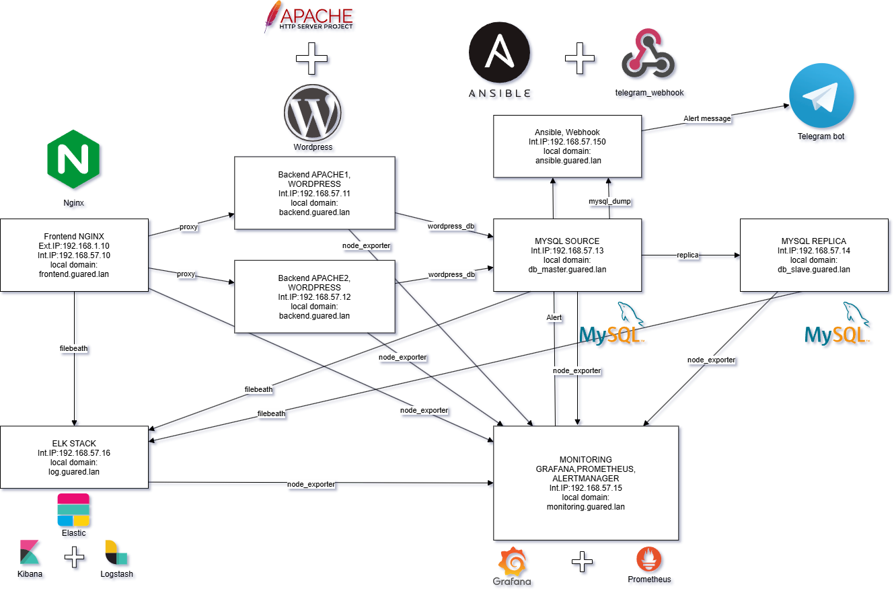

# Итоговый проект по курсу Администратор Linux Pro.    
## Задание    
Необходимо развернуть веб проект, состоящий из нескольких виртуальных машин, и отвечающий следующим требованиям:    
- включен HTTPS     
- настроен Firewall, закрыт порт 22 на Frontend      
- настроен мониторинг со сбором метрик и уведомлениями через Alertmanager в Telegram bot    
- организован централизованный сбор логов      
- организовано резервное копирование БД на сервер Ansible      

## Выполнение
Стенд разворачивается в **VirtualBox** с помощью **Vagrant** с использованием образа ОС _Ubuntu 22.04_. Создание виртуальных машин инициализируется командой:
```shell
vagrant up
```
*Примечание: все действия необходимо выполнять от имени пользователя* **root**    

### Описание инфраструктуры
| Server Name        | Private IP-address | Public IP-address | RAM    | CPU | Description                  |
|--------------------|--------------------|-------------------|--------|-----|------------------------------|
| **Frontend**       | 192.168.57.10      | 192.168.1.10      | 2 Gb   | 1   | Frontend web server          |
| **Backend-1**      | 192.168.57.11      | -                 | 2 Gb   | 1   | Backend web server           |
| **Backend-2**      | 192.168.57.12      | -                 | 2 Gb   | 1   | Backend web server           |
| **DB_Master**      | 192.168.57.13      | -                 | 1 Gb   | 1   | MySQL Server Master          |
| **DB_Slave**       | 192.168.57.14      | -                 | 1 Gb   | 1   | MySQL Server Slave           |
| **Monitoring**     | 192.168.57.15      | -                 | 1 Gb   | 2   | Monitoring server            |
| **Log**            | 192.168.57.16      | -                 | 6 Gb   | 6   | Log Server  ELK Stack        |
| **Ansible Server** | 192.168.57.150     | -                 | 1 Gb   | 1   | Ansible Webhook              |

  
### Карта сети
      

## Ansible
Настройка серверов выполняется с помощью оркестратора **Ansible**. Для выполнения настройки необходимо запустить плэйбуки:
```shell
ansible-playbook hosts.yml    ## настройка всех серверов для работы в локальном домене
ansible-playbook project.yml  ## установка софта и конфигурация серверов
```
### Структура проекта
```shell
├── ansible.cfg  
├── files  
├── inventory
│   ├── group_vars
│   │   └── all.yml
│   └── hosts.ini
├── project.yml
├── hosts.yml  
└── roles  
    ├── backend  
    ├── db  
    ├── frontend  
    ├── log  
    ├── monitoring  
    └── telegram_webhook 
```
- **ansible.cfg** - конфигурационный файл _ansible_
- **hosts.ini** - реестр серверов
- **all.yml** - список переменных, используемых в проекте
- **project.yml** - основной _playbook_ проекта
- **hosts.yml** - настрйока работы серверов в локальном домене
- **roles** - каталог с ролями, подключаемыми в _playbook_

### Описание ролей
#### frontend
Настройка фронтэнд сервера:
- установка и настройка _nginx_ в качестве балансировщика
- установка _node_exporter_
- установка _nginx_exporter_
- установка _filebeat_
- настройка _iptables_ 
#### backend
Настройка бекэнд серверов:
- установка и настройка _apache2_
- установка и настройка _WordPress_
- установка _node_exporter_
- настройка _iptables_ 
#### db
Настройка мастер и реплики БД серверов: 
- установка и настройка _MySQL_
- восстановление сохраненного дампа баз данных
- настройка репликации _MySQL_
- установка _node_exporter_
- установка _mysqld_exporter_
- установка _filebeat_
- настройка _iptables_ 
#### monitoring
Настройка сервера мониторинг:
- установка и настройка _Prometheus_
- установка и настройка _Grafana_
- установка и настройка _Alertmanager_
- установка _node_exporter_
- настройка _iptables_
#### log
Настройка сервера логирования:
- установка и настройка стека _ELK_
- установка _node_exporter_
- настройка _iptables_
### Ansible
- установка и настройка telegram_webhook    

## Результат
В результате выполнения playbook будет развернута следующая инфраструктура:   
Два бекэнд сервера **CMS Wordpress**, использующих БД **MySQL**;   
Фронтэнд сервер **Nginx**, осуществляющий балансировку нагрузки;   
Сервер мониторинга **Prometheus**+**Grafana**, собирающий метрики и рассылающий уведомления;   
Сервер логирования **ELK**, централизовано собирающий логи.   
